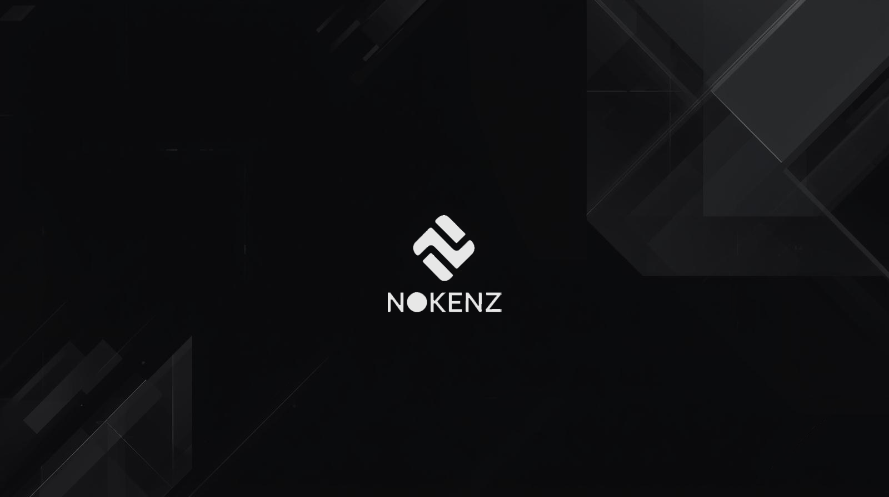
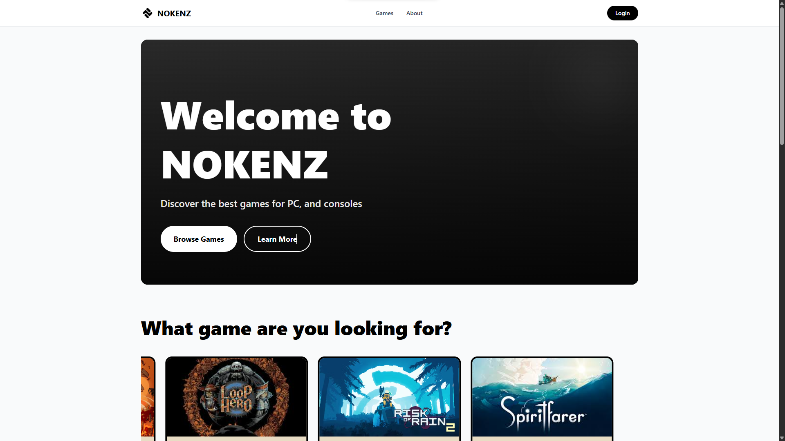

---
# NOKENZ — Game Store 

## 📌 Ringkasan Proyek

**NOKENZ** adalah aplikasi toko game kecil yang dibuat untuk keperluan **Tugas Akhir UAS**. Aplikasi ini memuat katalog game, detail produk, keranjang & checkout, manajemen order, dan panel admin untuk mengelola games, categories, news, users, orders, dan reviews.

Fitur utama:

- Dashboard & Admin Panel lengkap (CRUD games, categories, news, users, orders, reviews)
- Export data ke PDF & Excel (PDF menggunakan watermark; Excel menambahkan footer copyright)
- Keamanan: session regeneration pada login/register dan CSRF token diset untuk AJAX
- Responsive UI (mobile-first) dengan Tailwind CSS
- Thumbnail preview gambar pada daftar games (admin)

---

---

## 🎓 Keterangan Akademik
Proyek Nokenz dikembangkan sebagai bagian dari pemenuhan Ujian Akhir Semester (UAS) pada mata kuliah Web Programming 1.

**Detail Akademik:**

- Dosen Pengampu : Ibu Nova Agustina, S.T., M.Kom
- Nama : Haidir Mirza Ahmad Zacky
- NIM : 23552011072
- Mata Kuliah : Web Programming 1
- Semester : 5
- Program Studi : Teknik Informatika
- Perguruan Tinggi : Universitas Teknologi Bandung

---

## 🧰 Teknologi & Dependensi

- Laravel 12
- PHP ^8.2
- Tailwind CSS, Vite
- barryvdh/laravel-dompdf (PDF)
- maatwebsite/excel (Export Excel)
- PHPUnit untuk testing

Lihat juga `composer.json` dan `package.json` untuk detail versi dan script.

---

## 🚀 Setup & Menjalankan (Ringkas)

1. Clone repository:

```bash
git clone <repo-url>
cd nokenz-gs
```

2. Install dependency & konfigurasi env:

```bash
composer install
cp .env.example .env
php artisan key:generate
# Update .env untuk koneksi DB
php artisan migrate
php artisan db:seed # opsional
php artisan storage:link
npm install
npm run dev
php artisan serve
```

Atau jalankan script otomatis:

```bash
composer run setup
```

Akses: `http://127.0.0.1:PORT`

---

## 🔧 Script Penting

- `composer run setup`
- `npm run dev`
- `npm run build`
- `composer test` / `php artisan test`

---

## 📸 Screenshots




---

## 🎬 Video Demo

**Demo Video:** Coming Soon 

---

## 🌐 Live Demo

Tambahkan link deploy di bawah ini:

**Live Demo:** https://nokenz.ComingSoon.com

---

## 🔒 Catatan Keamanan & Implementasi

- Session fixation: session diregenerasi pada login/register.
- CSRF token disisipkan di layout utama dan axios otomatis membaca token tersebut.
- Exports menggunakan container bindings (`app('dompdf.wrapper')`, `app('excel')`) untuk kompatibilitas.

---

## 📁 Struktur Ringkas

- `app/` — business logic & models
- `resources/views/` — blade views (user & admin)
- `public/assets/images/` — logo & gambar
- `routes/web.php` — route definitions
- `database/migrations` & `database/seeders`

---

## ✅ Lisensi

Proyek ini menggunakan lisensi **MIT** (lihat `composer.json`).

---
